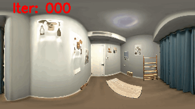
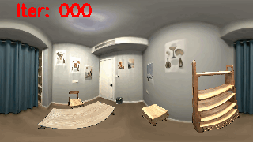

# Neural Rendering in a Room: Amodal 3D Understanding and Free-Viewpoint Rendering for the Closed Scene Composed of Pre-Captured Objects
### [Project Page](https://zju3dv.github.io/nr_in_a_room/) | [Video](https://www.youtube.com/watch?v=-gPvoZHtuGE&) | [Paper](https://arxiv.org/pdf/2205.02714.pdf)

<div align=center>

</div>

> [Neural Rendering in a Room: Amodal 3D Understanding and Free-Viewpoint Rendering for the Closed Scene Composed of Pre-Captured Objects](https://arxiv.org/pdf/2205.02714.pdf)  
> Bangbang Yang, Yinda Zhang, Yijin Li, Zhaopeng Cui, Sean Fanello, Hujun Bao, Guofeng Zhang.
> SIGGRAPH 2022 (ACM ToG)


## Installation
We have tested the code on pytorch 1.8.1, while a newer version of pytorch should also work.

```bash
conda create -n neural_scene python=3.8
conda activate neural_scene
pip install torch==1.8.1+cu111 torchvision==0.9.1+cu111 torchaudio==0.8.1 -f https://download.pytorch.org/whl/torch_stable.html
pip install -r requirements.txt
```

## Data Preparation

Please go to the [data preparation][1].


## Offline-Stage Training

After putting the necessary data into the `data` folder, you can run `batch_train_nerf.sh` to train NeRF model for each object and background.
You can check the `data/root_dir` in the corresponding config file to make sure the data path is correct.

## Online-Stage Optimization

### Object Pose Optimization

We provide the example in `script/pose_optim.sh` to optimize object poses. You can change the input parameters (including paths, arrangement names) to optimize different scenes.


### Scene Lighting Optimization

Once the object pose has been optmized properly, we can further optimize scene lighting by running `script/real_scene_light_optim.sh`.
You might need to change the input parameters and the pose state file (e.g., `state_file=debug/xxx/000480.state.ckpt`) to match the scenes with optimized poses.


<div align=center> <div style="float:left; width:50%;">  <h4>Pose Optim.</h4> </div> <div style="float:left; width:50%;">  <br> <h4>Lighting Optim.</h4> </div> </div>

The pre-trained checkpoints would be uploaded later.


## Citation

If you find this work useful, please consider citing:

```
@article{yang2022_nr_in_a_room,
    title={Neural Rendering in a Room: Amodal 3D Understanding and Free-Viewpoint Rendering for the Closed Scene Composed of Pre-Captured Objects},
    author={Yang, Bangbang and Zhang, Yinda and Li, Yijin and Cui, Zhaopeng and Fanello, Sean and Bao, Hujun and Zhang, Guofeng},
    journal = {ACM Trans. Graph.},
    issue_date = {July 2022},
    volume = {41},
    number = {4},
    month = jul,
    year = {2022},
    pages = {101:1--101:10},
    articleno = {101},
    numpages = {10},
    url = {https://doi.org/10.1145/3528223.3530163},
    doi = {10.1145/3528223.3530163},
    publisher = {ACM},
    address = {New York, NY, USA}
}
```


## Acknowledgement

In this project we use (parts of) the implementations of the following works:

- [iGibson](https://github.com/StanfordVL/iGibson) by StanfordVL.
- [NeuS](https://github.com/Totoro97/NeuS) by Totoro97.
- [neurecon](https://github.com/ventusff/neurecon) by ventusff.
- [nerfplusplus](https://github.com/Kai-46/nerfplusplus) by Kai-46.
- [SphericalHarmonics](https://github.com/chalmersgit/SphericalHarmonics/) by chalmersgit.
- [nerf_pl](https://github.com/kwea123/nerf_pl/) by kwea123.

We thank the respective authors for open sourcing their methods. 

[1]: ./data_preparation/